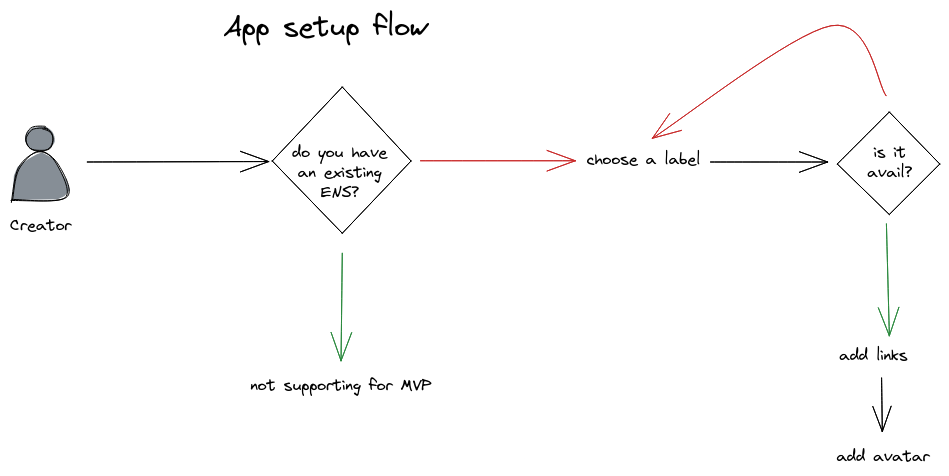

# LinkENS Dapp

The Dapp for creating link aggregator sites. Contains marketing (the landing page) and a wizard for generating sites.

Content:

* [Setup](#setup)
* [Deploy](#deploy)
* [Designs](docs/designs)
* [App flows](#app-flows)

## Setup

1. Clone the project and switch to _site_
    ```sh
    git clone https://github.com/0xcharchar/ethonline2021.git
    cd ethonline2021/site
    ```
2. Optional: set node version with NVM
    ```sh
    nvm use
    ```
3. Install dependencies
    ```sh
    npm install
    ```
4. Create environment file
    ```sh
    touch .env
    ```
5. Fill in environment value with template and your data
    ```sh
    # The URL of the backend netlify function
    DEPLOY_IPFS_ROUTE=http://localhost:7000/.netlify/functions/ipfs-deploy
    
    # Dependent on the ethereum network
    RESOLVER_ADDRESS=
    
    # Same across main and all testnets
    ENS_REGISTRY_ADDRESS=0x00000000000C2E074eC69A0dFb2997BA6C7d2e1e
    
    # The ENS name you have registered
    ENS_NODE=somewhere.test
    
    # The address when deployed
    SITE_MANAGER_ADDRESS=

    # Third party API keys
    WALLET_CONNECT_API=
    INFURA_PROJECT_ID=
    INFURA_PROJECT_SECRET=
    ALCHEMY_API_RPC_URL=
    ALCHEMY_API_KEY=
    ETHEREUM_NETWORK_KEY=ropsten
    ```

## Deploy

Deploying the dapp requires the [SiteManager](/contracts/README.md) and the
[Backend](/backend/README.md) to be deployed first. Once that is complete,
update the _site/.env_ file with the appropriate information and move to the
next step.

On localhost:

```sh
npm run dev
```

On production, the site is deployed to IPFS via Fleek.

## App flows

### Creating a new page



### Loading a user page

These are separate HTML files that are deployed to IPFS. This flow shows how each page loads itself.


